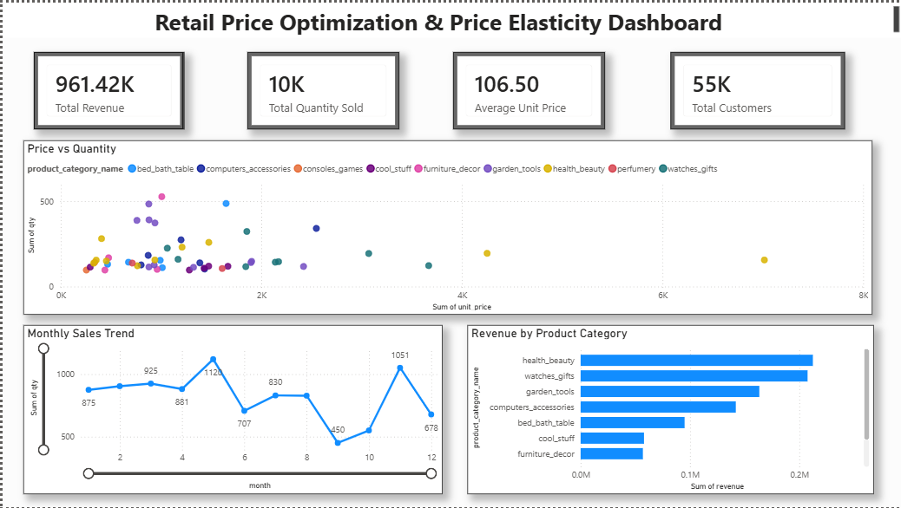

# 📈 Retail Price Optimization & Price Elasticity Analysis

## 📌 Project Overview

Pricing is one of the most important factors influencing customer purchasing behavior. Setting prices too high can reduce demand, while setting them too low may reduce profitability.

This project analyzes a retail pricing dataset to understand how product prices affect customer demand. It combines exploratory data analysis, machine learning, and interactive Power BI dashboards to provide data-driven pricing insights and business recommendations.

---

## 🎯 Objectives

- Analyze the relationship between product prices and customer demand.
- Identify factors influencing product sales.
- Build machine learning models to predict quantity sold.
- Compare different regression models.
- Visualize key business metrics using Power BI.
- Provide pricing recommendations based on data analysis.

---

## 📂 Dataset

**Source:** Kaggle - Retail Price Optimization Case Study

The dataset contains information about:

- Product Information
- Product Category
- Unit Price
- Quantity Sold
- Freight Price
- Customer Count
- Competitor Prices
- Product Ratings
- Sales Information
- Date Information

---

## 🛠️ Technologies Used

- Python
- Pandas
- NumPy
- Matplotlib
- Seaborn
- Scikit-learn
- Power BI
- Jupyter Notebook

---

## 📊 Project Workflow

### 1. Data Cleaning

- Loaded the dataset
- Checked data types
- Handled missing values
- Checked duplicate records
- Performed statistical summary

---

### 2. Exploratory Data Analysis (EDA)

Performed various visualizations including:

- Quantity Sold Distribution
- Unit Price Distribution
- Box Plot Analysis
- Price vs Quantity Scatter Plot
- Product Category Analysis
- Correlation Heatmap
- Monthly Sales Trend
- Revenue Distribution
- Competitor Price Comparison

---

### 3. Feature Engineering

Created business-related features including:

- Revenue
- Average Competitor Price
- Price Difference
- Price Ratio

---

### 4. Machine Learning

Built and compared multiple regression models:

- Linear Regression
- Decision Tree Regressor
- Random Forest Regressor

Model evaluation metrics:

- Mean Absolute Error (MAE)
- Root Mean Squared Error (RMSE)
- R² Score

---

### 5. Price Elasticity Analysis

Analyzed:

- Relationship between price and demand
- Price correlation
- Revenue trends
- Competitor pricing
- Business recommendations

---

### 6. Power BI Dashboard

Developed an interactive dashboard containing:

- KPI Cards
- Monthly Sales Trend
- Revenue by Product Category
- Price vs Quantity Analysis
- Interactive Filters

---

## 📈 Machine Learning Results

| Model | R² Score |
|--------|---------:|
| Decision Tree | **0.934** |
| Random Forest | **0.919** |
| Linear Regression | **0.826** |

The Decision Tree Regressor achieved the best predictive performance and was selected as the final model.

---

## 💡 Key Business Insights

- Product demand generally decreases as prices increase.
- Lower-priced products tend to achieve higher sales volumes.
- Product categories contribute differently to overall revenue.
- Competitor pricing plays an important role in pricing strategy.
- Data-driven pricing decisions can improve revenue while maintaining customer demand.

---

## 📊 Dashboard Preview

> Add a screenshot of your Power BI dashboard here.

Example:

```markdown

```

---

## 📁 Project Structure

```
retail-price-elasticity-analysis/
│
├── data/
├── notebooks/
├── dashboard/
├── images/
├── README.md
├── requirements.txt
└── .gitignore
```

---

## 🚀 Future Improvements

- Hyperparameter tuning
- Cross-validation
- Price elasticity coefficient calculation
- Revenue optimization simulation
- Interactive web application using Streamlit

---

## 👩‍💻 Author

**Srujana M**

Aspiring Data Scientist | Python | SQL | Machine Learning | Power BI
